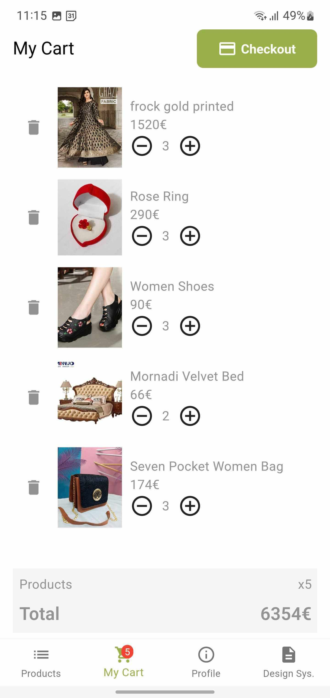
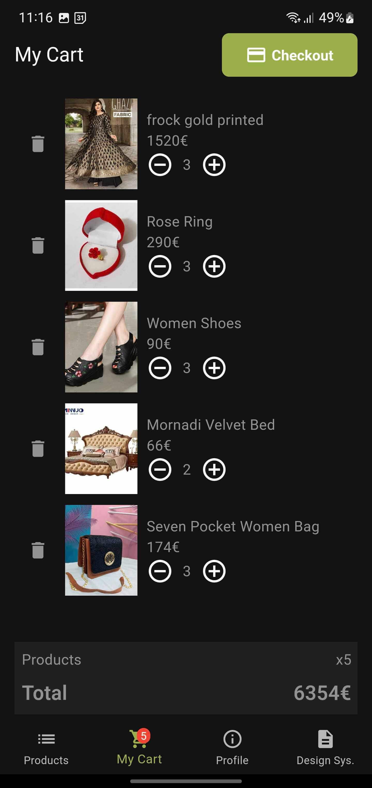
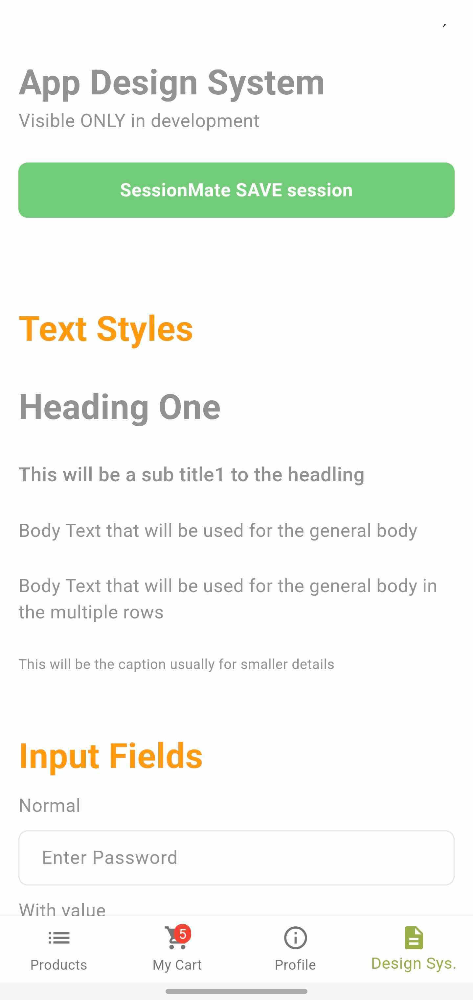
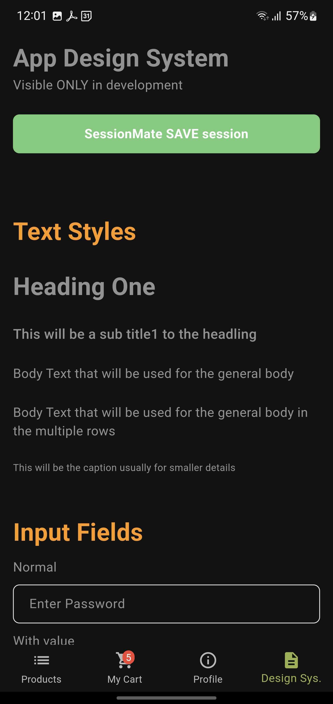

# ShopIT

Demo App is based on Stacked Architecture
with the Model-View-ViewModel (MVVM) architectural pattern

| Light Theme                                           | Dark Theme                                           |
|-------------------------------------------------------|------------------------------------------------------|
|    |    |
|    |    |
|  |  |
|                      |                      |
|    |    |

## App has the following features:

- Get users. Search users. Select user to login with.
- Login user.
- Products list / grid. Products search. Adding products to shopping cart.
- Product detail.
- Shopping cart.

## Additional:

- Localization - Multi-language support
- Support different app Environments
    - Development:
      `flutter run --dart-define-from-file=assets/environments/development.json`
    - Staging:
      `flutter run --dart-define-from-file=assets/environments/staging.json`
- Build in Design system
- Themes support (light/dark)
- User Auto login
- Support Session Mate (HOW TO: https://www.filledstacks.com/post/session-mate-get-started/):
    - RUN session mate recorder:
        1. `flutter run --dart-define-from-file=assets/environments/staging.json
           --dart-define=RECORD_SESSION=true`
        2. record user interactions
        3. when you are done, in bottom navigation select Design Sys. and press "SessionMate SAVE
           session" Button
    - RUN session mate player - from terminal:
      `sessionmate drive -p . --additional-commands="--debug --dart-define-from-file=assets/environments/staging.json"`

## Main libraries:

- stacked (state management, navigation, dialogs, MVVM, services, reactive services, dependency
  Inversion, unit test stubs).
- flex_color_scheme for theming.
- retrofit api client.

## Api for demo data:

https://dummyjson.com

Crafted with ❤️ 